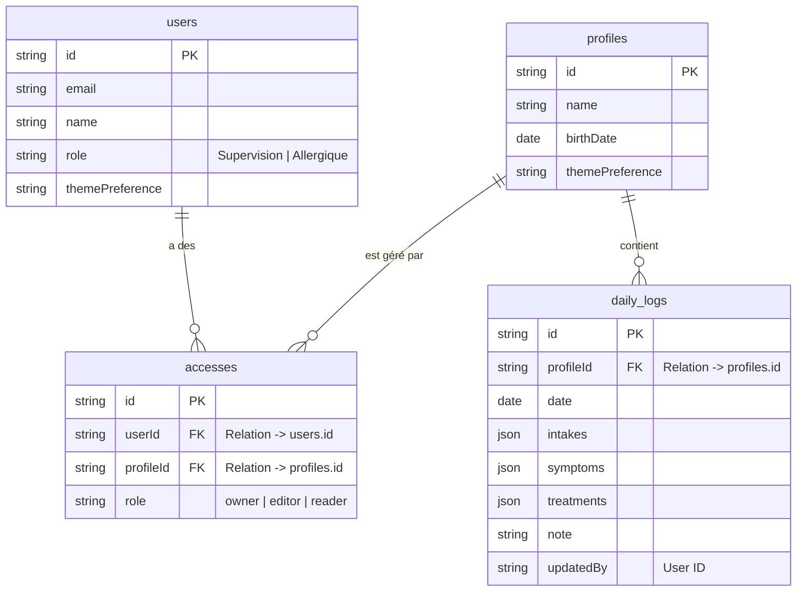

# Modèle Conceptuel de Données (MCD)

Ce document décrit la structure de la base de données PocketBase. **Toute modification du modèle de données doit être reportée ici.**

## Règles de Gestion (ACL)

- **Propriété** : Définie par une ligne dans `accesses` avec le rôle `owner`. Les propriétaires ont tous les droits sur le profil et ses logs.
- **Partage (Édition)** : Définie par le rôle `editor`. Permet la lecture et la modification des logs et du profil.
- **Partage (Lecture)** : Définie par le rôle `reader`. Permet uniquement la consultation.
- **Isolation** : Chaque `daily_log` est rattaché à un unique `profileId`.
