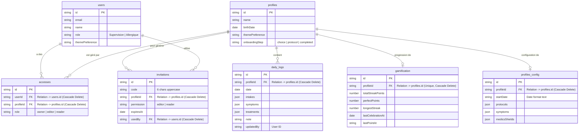

# Modèle Conceptuel de Données (MCD)

Ce document décrit la structure de la base de données PocketBase. **Toute modification du modèle de données doit être reportée ici.**

## Règles de Gestion (ACL)

- **Propriété** : Définie par une ligne dans `accesses` avec le rôle `owner`. Les propriétaires ont tous les droits sur le profil, ses logs et sa gamification.
- **Partage (Édition)** : Définie par le rôle `editor`. Permet la lecture et la modification des logs, du profil et de la gamification.
- **Partage (Lecture)** : Définie par le rôle `reader`. Permet uniquement la consultation.
- **Isolation** : Chaque `daily_log`, record `gamification` et `profiles_config` est rattaché à un unique `profileId`.
- **Suppression en cascade** : La suppression d'un `profile` entraîne automatiquement la suppression de ses `accesses`, `daily_logs`, `profiles_config`, `gamification` et `invitations`.
